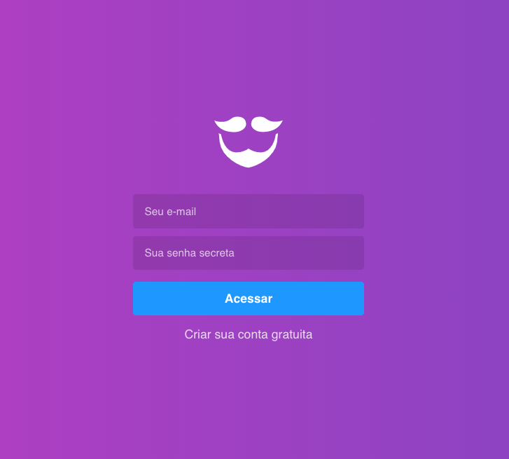
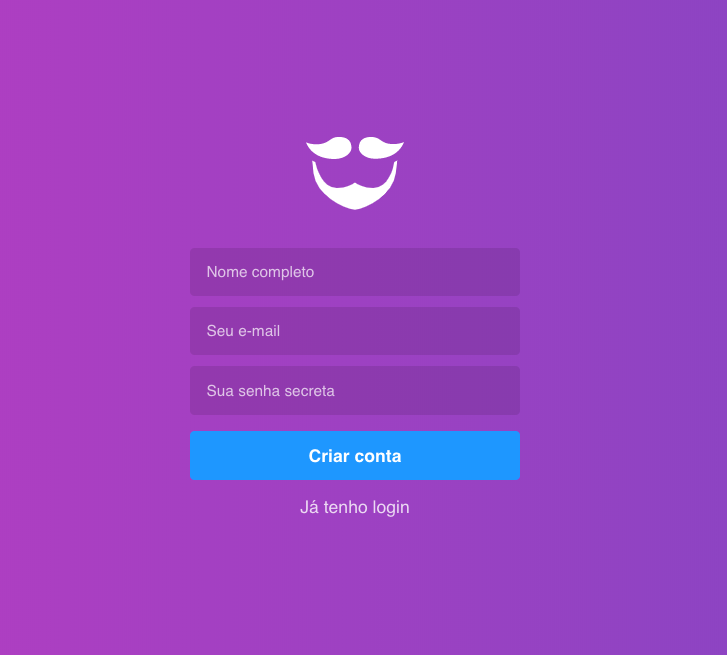

<h1 align="center">
  
</h1>

<h3 align="center">
      Gympoint
</h3>

<blockquote align="center">“Não fique olhando o relógio faça como ele mexa-se”!</blockquote>

<p align="center">
  
  
</p>

<p align="center">
  <a href="#Sobre o Projeto">Sobre o projeto</a>&nbsp;&nbsp;&nbsp;|&nbsp;&nbsp;&nbsp;
  <a href="#Dependencias">Dependencias</a>&nbsp;&nbsp;&nbsp;|&nbsp;&nbsp;&nbsp;
  <a href="#Ferramentas">Ferramentas</a>&nbsp;&nbsp;&nbsp;|&nbsp;&nbsp;
</p>

## Gympoit: Sobre o projeto

Continução do projeto **Gympoint**. Neste repositorio sera desenolvido a interface web com o usuário.

[Backend da aplicão em nodeJS][backend]

<h1 align="center">
  
  
</h1>

### Ferramentas utilizadas

- Sucrase + Nodemon;
- ESLint + Prettier + EditorConfig + customize-cra;

### Dependencias do projeto

-rocketseat/unform
-history
-polished
-prop-types
-styled-components
-yup

### informações para uso do codigo

Para esta aplicaçao voce precisar ter instalado o [Node.js][nodejs], [Yarn][yarn] no seu computador para conseguir usar as linhas de comando abaixo.

```bash
#Clone o repositorio com o comando
$git clone https://github.com/guilhermeseckert/Grympoint Gympoint

#Navegue ate pasta
$ cd Gympoint

#Instalar as dependencias do projeto
$ yarn install

#Iniciando o projeto
$ yarn start
```

<h1 align="center" border-radius= "50%">
  
</h1>

Made with by Guilherme S.Eckert :wave: [Get in touch!](https://www.linkedin.com/in/guilherme-eckert/)

[nodejs]: https://nodejs.org/
[yarn]: https://yarnpkg.com/
[docker]: https://www.docker.com/
[backend]: https://github.com/guilhermeseckert/GYMPOINT
